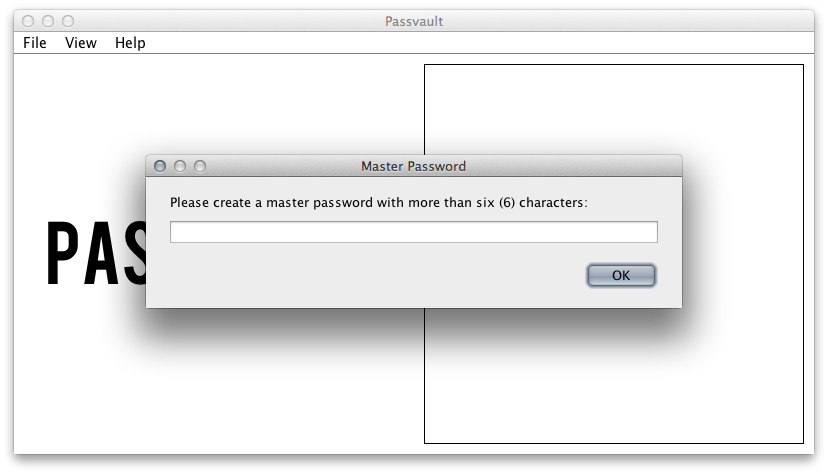
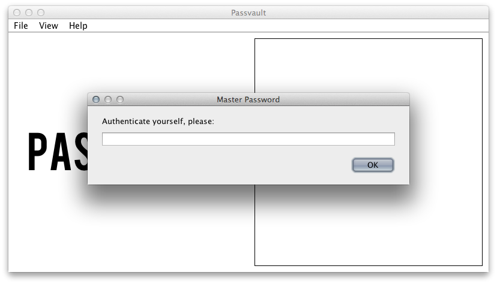
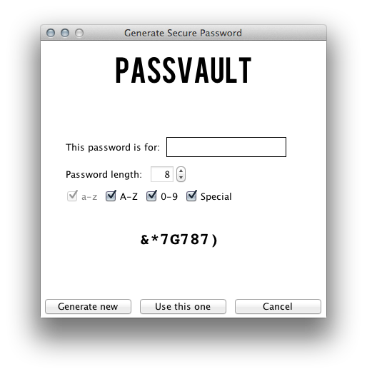
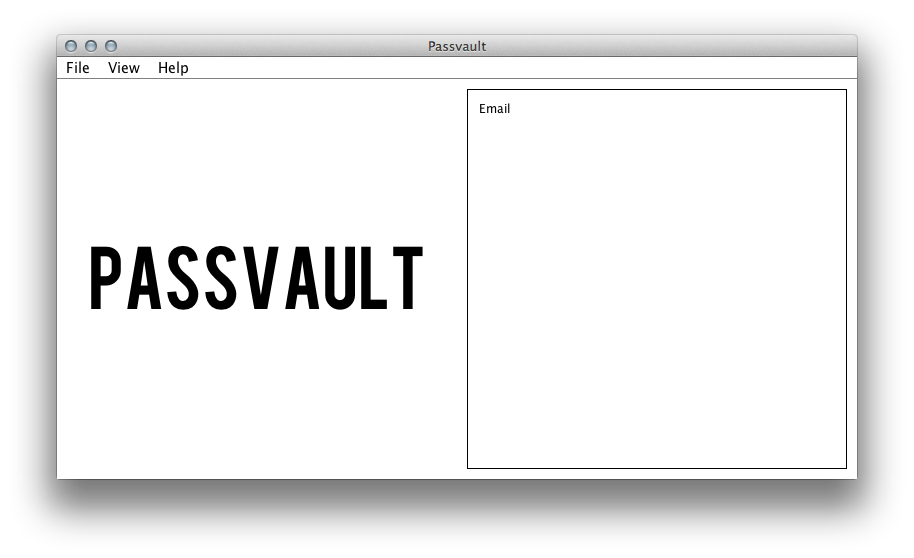
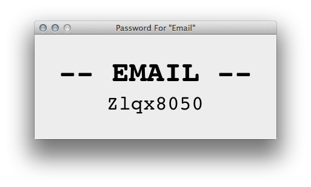

Passvault
=========

Passvault is a rudimentary password manager and password generator. It uses Java's security and cryptography APIs to encrypt and store the list of passwords to disk.

(Note that **there is a fatal insecurity in this program**. The master password can be changed or removed by overwriting or deleting the `.pwd` file in the installation directory. If this happens, all the passwords that were previously saved will still remain, and can/will be seen by others.)

Once the main class has been compiled, all the required files will reside in the same directory, and future launches of the program will need to be done from the same directory.

Usage
=====

Compile and run `Passvault.java`.

On the first launch of the program, you will be prompted to create a master password (Fig. 1). This will be used to authenticate the user on subsequent launches of the program (Fig. 2).

To create a new password entry, select Add Password from the File menu, enter the name of the service, and generate a random secure password (Fig. 3). This new password will be added to the list on the right side (Fig. 4). To view the password, double-click on the entry in the list; the password will be displayed in large visible-to-everybody-in-the-room print (Fig. 5).

There is no option to delete a password.

**Figures 1-5**

Credit
======

Credit to [XKCD][6] for the two comics to which I have linked, and to [Flat-it](http://flat-it.com/) for the Bebas typeface.

  [6]:http://xkcd.com
